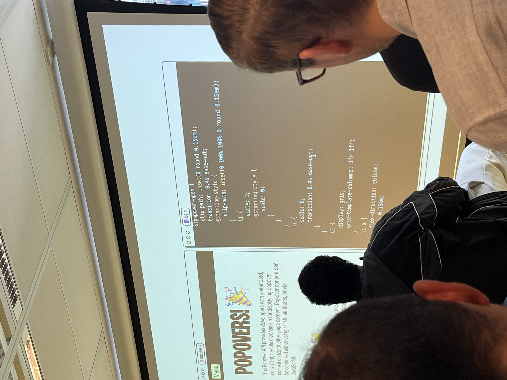
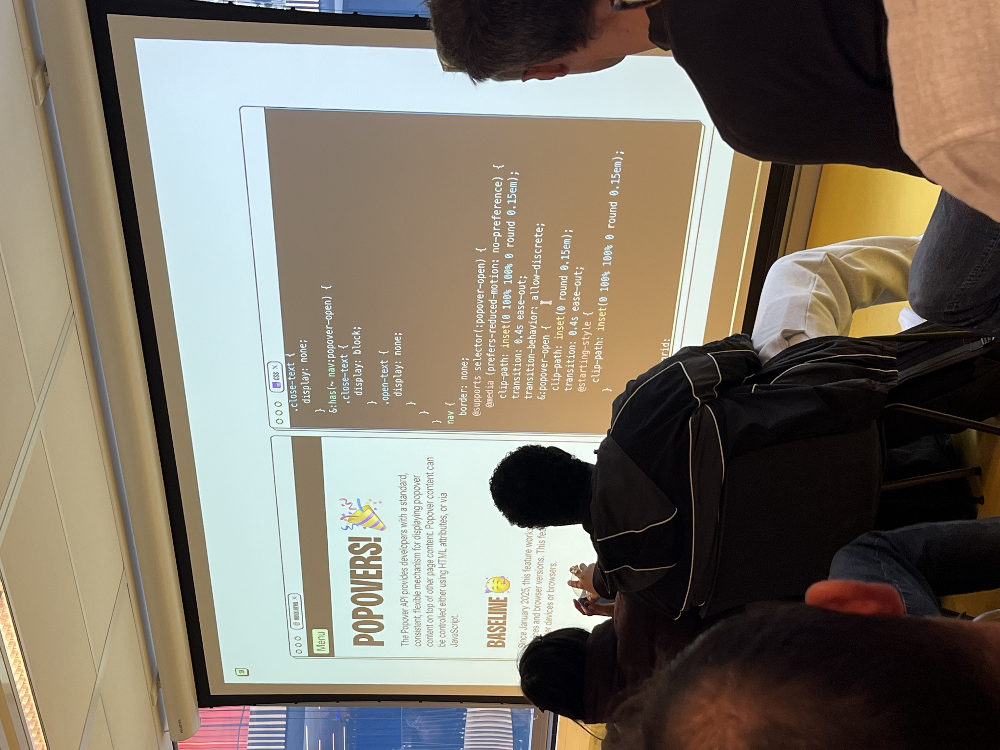

# The web you want 
Dag 2  
10 Juni 2026

## Léonie Watson
- Laat AI pictures op de website omschrijven omdat de alt teksten niet genoeg info hebben
- Gebruikt meta data bril om een foto van de omgeving te beschrijven op reis
- Gebruikt een app om spullen in de omgeving te vinden, bijv. een laptop
- Ai is een interprenter voor blinde mensen
- Ai is compensating for where the web has failt. The web build by us.

## Cyd Stumpel
- Mensen kopieeren elkaars website vaak
- Progressive enhancement! 
- Vraag je eerst af wat de core task is
- Gebruik goeie HTML zoals het detail element
- CSS `@supports(interpolate-size: allow-keywords){}`
- Met `allow-discrete` in `transition-behavoir` kan je het dichtklappen van de details animeren
- `sibling-index` voor een kleine stagger gebruiken
- Het wordt belangrijker om hetverschil tussen goede en slechte code te kunnen herkennen

## Sara Joy
- Heeft websites gemaakt met de code eronder zodat non-devs kunnen zien hoe het werkt
- Moeten alle oefen websites accessible zijn voor alle mensen als het alleen voor jezelf bedoeld is?
- Sophie Koonin - building websites like it's 1999... in 2022
- whimsica11y.net
- Delightfull is when it just works
- Als je een afbeelding van kunst hebt moet je ALT tekst ook kunst zijn