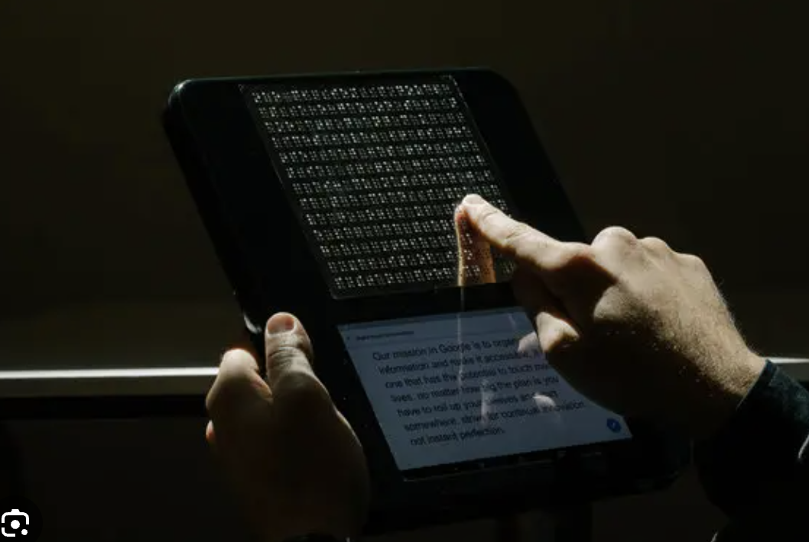

# Bram Duivigneau 

## Over Bram
- Hij vond het zinvol om met toegankelijk bezig te zijn
- Begonnen in de backend
- Perongeluk doorgegroeird richting de accessebility kant van het web
- Dingen bouwen die impact hebben

## Verschil hond en stok vergelijking met code
### Stok
- Op development niveau heel lang bezig zijn als een man met een blindgeleide stok
- Een obstacel aantikken met een stok, je afvragen hoe je er langs komt en wat het is
- Heel low level beezig zijn met hoe kom ik waar ik zijn moet

### Hond
- Als je met een hond loopt ben je veel meer bezig waar gaan we naar toe en hoe kom ik daar
- De hond denkt met je mee
- Je hoeft niet meer zelf heel erg op te letten op elk detail
- Een hond is een soort tool die er voor zorgt dat je veel beter bezig kan zijn met mensen om je heen ipv te gefoccust zijn op nergens tegenaan lopen
- AI is een soort tool als hond

### Robot
- Het ziet er niet uit, maar het werkt wel
- De robot werkt een beetje het zelfde als een echte hond
- Het werkt altijd op de zelfde manier (voor zover het betrouwbaar is)
- De batterij kan wel leeg gaan
- Routes kan hij ofline doen, trappen heb je nog wel internet verbinding voor nodig (een soort googlemaps hond)
- Wat mis je bij een robot hond? De intuitie van de hond, een hond kan bijv routes herkennen

## Zelfrijdende auto's
- Een app voor de zelfrijdende auto die de route aangeeft met tikjes als je in de juiste richting loopt naar waar de auto voor komt te rijden
- De app heeft een toeter knop (misschien alleen voor screenreaders?) zodat je de auto ook zonder zicht kan vinden
- De app heeft ook een knopje om de kofferbak te openen

## Smart glasses
- De bril is door meta nooit gebouwd als toegankelijkheids product
- Veel mensen die blind zijn of een zichtsbeperking hebben hebben er wel profijt van
- Er komt ook gezichtsherkenning naar toe misschien 
- De bril kan nu al zeggen wat er te zien is in de omgeving
- Je kan kiezen welke vorm van beschrijving je wilt, de normale versie of de gedetailleerde versie

## LLM is getraind op wat er al was, jij op wat je hebt meegemaakt
- AI modelen zijn getraind op wat we nu weten en wat er al is en kunnen zelf geen nieuwe ideeen bedenken
- Wij als mensen kunnen nieuwe ideeen bedenken 
- Als developers opschrijven, wat wil ik bouwen, wat kan ik bouwen samen kunnen werken met AI door dat het sneller werkt
- Developers kunnen nieuwe dingen bedenken en dat is onze kracht 
- Wij als mensen: niet alleen dingen bouwen om het bouwen maar er overnadenken waarom we het bouwen en voor wie
- AI is niet zo goed in het maken van toeganklijke dingen
- check je code met een screenreader, AI vs mensen code

## Braille screenreader
- Aan de hand van wat er op het laptop screen staat komen er puntjes op een braille device waardoor hij de puntjes kan lezen

## Coderen met screenreader
- In vscode zitten allemaal accessebility functies die je krijgt als je vscode opstart met screenreader aan
- De screenreader leest de regel voor waar je muis staat geklikt
- Er is een gebuildje voor een error (het braille device geeft het ook aan in braille)
- vscode is de enige mainsteam edditor die dit serieus nam
- De autocompleet netjes wordt voorgelezen
- Dat de dropdown lijstjes ook toegankelijk zijn
